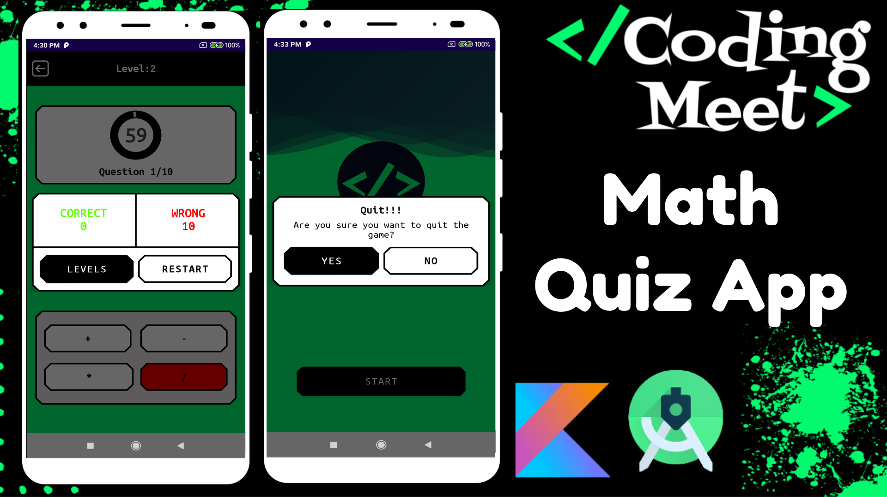

# Math Quiz App Android Studio Kotlin - Video Tutorial Series

Welcome to the Math Quiz App development tutorial series! In this series, we'll guide you through the process of creating a Math Quiz App using Android Studio and Kotlin. Each part of the series covers a specific aspect of app development.

## Overview

Building a Math Quiz App can be both fun and educational. This series is designed to help you grasp fundamental concepts in Android development while creating an engaging and interactive application. The videos are structured to take you through the entire development lifecycle, from designing screens to implementing advanced features like encryption and API key security.

Whether you're a beginner or an experienced developer, this tutorial series will provide valuable insights and hands-on experience. By the end of the series, you'll have a fully functional Math Quiz App with enhanced security features.

## Youtube Playlist [Link Here](https://youtube.com/playlist?list=PLlSuJy9SfzvHpc1-IcBTbZnyeBoVCynPE)

1. **Part 1: Design Welcome or Splash Screen**
   Learn to design an engaging welcome or splash screen for your app.

3. **Part 2: Design Toolbar and Level Screen**
   Dive into designing the toolbar and level screen elements for your app.

4. **Part 3: Design Question Screen**
   Explore the process of designing the question screen in your Math Quiz App.

5. **Part 4: Design Score and Exit Dialog**
   Create intuitive score and exit dialogs to enhance user experience.

6. **Part 5: Read JSON File and Countdown Timer**
   Implement reading data from a JSON file and adding a countdown timer.

7. **Part 6: Choose Answer and Calculate Points**
   Learn to allow users to choose answers and calculate points dynamically.

8. **How to Encrypt and Decrypt a File in Android Studio Kotlin**
   Understand the essentials of file encryption and decryption in Android Studio using Kotlin.

9. **Part 7: Question.json Encrypt & Decrypt File**
   Implement encryption and decryption for the Question.json file in your app.

10. **Part 8: Two Option Remove**
   Explore how to implement a feature to remove two options for a question.

11. **How to Secure API Key or String Using Library Android Studio Kotlin**
    Securely manage API keys and strings using libraries in Android Studio with Kotlin.

12. **How to Secure API Key or String Using NDK Android Studio Kotlin**
    Enhance security by utilizing the Native Development Kit (NDK) for API key and string protection.

13. **How to Secure API Key or Text Using NDK and Encryption Android Studio Kotlin**
    Implement NDK and encryption for added security in managing API keys and text.

14. **Part 9: All Password Encryption using NDK and Library**
    Securely handle all password-related operations through a combination of NDK and library usage.

## Getting Started

Make sure to follow the videos in order for a seamless learning experience. Each video builds on the previous one, helping you understand the complete app development process.

## Screenshots

## How to Use This Repository

- Clone the repository to your local machine.
- Follow along with the video tutorials.
- For videos involving encryption, find the relevant code and explanations in the corresponding folders.

## Support the Project

If you find this tutorial series helpful and would like to support the development of more content, consider buying me a coffee! Your support helps in creating high-quality tutorials.

Your generosity is greatly appreciated! Thank you for supporting this project.

Happy coding!
